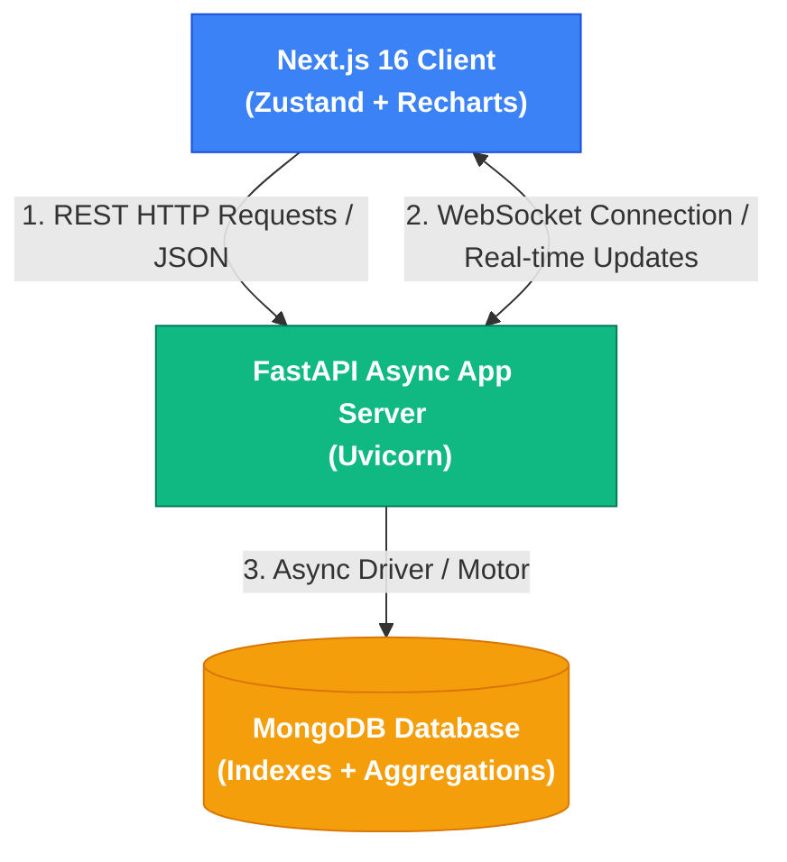

# QuizPulse — WhatsApp-Inspired Micro-Learning Analytics Platform

Live Demo : https://quiz-pulse-roan.vercel.app/

QuizPulse is a production-quality, gamified EdTech quiz platform designed to replicate micro-learning user flows (popularized by WhatsApp groups and Duolingo) combined with deep, recruiter-level SaaS telemetry powered directly by optimized MongoDB aggregation pipelines.

---

## 🚀 Key Architectural Strengths

1. **Modular FastAPI Backend**: Asynchronous endpoints using the `Motor` driver. Structured cleanly across configuration, database connections, schemas, routes, and a dedicated aggregation analytics engine.
2. **Real-time Live Leaderboard (WebSockets)**: Exposes a `/api/ws/leaderboard` WebSocket endpoint that automatically broadcasts scores updates to all active leaderboard viewers when any candidate completes a quiz.
3. **MongoDB Aggregation Pipelines**: No basic CRUD. The SaaS analytics dashboard is generated through complex, high-performance aggregation pipelines running on native MongoDB indexes:
   * **Daily & Weekly Active Users (DAU/WAU)**: Grouping distinct user triggers chronologically over 30 days.
   * **Latency Percentiles (p50 & p95)**: Calculated alongside averages to reveal true user experience bottlenecks.
   * **Completion Funnel (Cohort Drop-off)**: Tracking cohort survival counts over progressive steps.
   * **Difficulty Heatmap & Calibration**: Grouping chapters by difficulty and computing accurate answer ratios, plus auto-flagging miscalibrated questions.
4. **Zustand Frontend Store**: Client-side state autosaving. If a user quits during an active quiz session, they are prompted to instantly resume their session.
5. **Mock User Selector**: A recruiter sandbox dropdown in the header allowing users to switch between 100 seeded profiles to view respective dashboard statistics, learning streaks, bookmarks, and completed attempts in real time.
6. **WhatsApp Micro-Learning Bubble Design**: Highly responsive, slate-glassmorphism visuals utilizing modern gradients, hover transitions, and fluid animations.
7. **Pydantic V2 Integrity**: Custom field-level and model-level schema validations enforcing data integrity on submissions.

---

## 🛠️ Technology Stack

* **Frontend**: Next.js 15 (App Router), React, TypeScript, Tailwind CSS, Zustand, Recharts, Axios, Lucide Icons.
* **Backend**: FastAPI (Python), Motor (Async MongoDB Driver), Pydantic (data validation), Pytest, Faker.
* **Database**: MongoDB (supporting compound indexes, unique constraints, and aggregate pipelines).
* **Containerization**: Docker & Docker Compose.

---

## 🗺️ System Architecture



---

## 📊 Analytics Telemetry Engine Explanations

1. **Daily / Weekly Active Users**: Scrapes `analytics_events` to compile distinct user IDs performing actions. This gives recruiters an authentic insight into daily product usage trends.
2. **Peak Activity Hours**: Extracts the hour field from session `startedAt` timestamps to locate when users are most active.
3. **Drop-off Funnel**: Compares completed sessions against active ones, checking how many questions were answered before drop-off to optimize quiz length.
4. **Chapter Difficulty Heatmap**: Performs multiple `$lookup` operations joining question attempts to their parent chapter, calculating accurate answer ratios, and classifying them as high command, developing, or requiring practice.

---

## 📂 Project Directory Structure

```
quizpulse/
├── backend/
│   ├── app/
│   │   ├── main.py              # Application initialization
│   │   ├── config/              # Base environment settings
│   │   ├── database/            # Connection establishment 
│   │   ├── models/              # Pydantic schemas and database models
│   │   ├── routes/              # Exams, Quiz, and Analytics endpoints
│   │   ├── analytics/           # Optimized aggregation queries
│   │   ├── utils/               # Custom PyObjectId serializers
│   │   └── seed/                # Faker mock database seeder
│   ├── Dockerfile
│   └── requirements.txt
│
├── frontend/
│   ├── src/
│   │   ├── app/                 # Next.js 15 App router views
│   │   ├── components/          # Shared layout and palette panels
│   │   ├── store/               # Zustand global state (Autosaves)
│   │   └── lib/                 # Axios configurations
│   ├── Dockerfile
│   └── package.json
│
├── docker-compose.yml
└── README.md
```

---

## ⚡ Setup & Run Instructions

To spin up the application on macOS in under 5 commands:

### 1. Start MongoDB
Ensure MongoDB is running locally on port `27017` via Homebrew:
```bash
brew services start mongodb-community
```

### 2. Setup & Run Backend
Navigate to the `backend` folder, install requirements (including Pydantic V2 and testing suites), seed mock candidate profiles, and run the FastAPI server:
```bash
cd backend && python3 -m venv venv && source venv/bin/activate && pip install -r requirements.txt && python app/seed/seed.py && uvicorn app.main:app --reload
```

### 3. Setup & Run Frontend
In a new terminal window, navigate to the `frontend` folder, install dependencies, and run the Next.js dev server:
```bash
cd frontend && npm install && npm run dev
```

* **Frontend UI**: [http://localhost:3000](http://localhost:3000)
* **FastAPI Backend Swagger**: [http://localhost:8000/docs](http://localhost:8000/docs)
* **MongoDB Port**: `localhost:27017`

---

## 💡 Design Decisions

### 1. Zustand vs. React Context
* **Decision**: Chose **Zustand** over React Context for global state management.
* **Rationale**: React Context triggers a re-render on all consumer components whenever any part of the context value updates, causing performance issues in complex UIs. Zustand uses a publisher-subscriber model with selector functions (e.g. `useQuizStore(state => state.currentUser)`), which ensures components only re-render when their specific sliced state changes. This is critical for the active quiz interface which autosaves progress continuously and tracks timers.

### 2. Motor vs. PyMongo
* **Decision**: Chose **Motor** for database transactions in the FastAPI server.
* **Rationale**: PyMongo is a synchronous/blocking driver. Under high loads, blocking calls on the database halt FastAPI's event loop, destroying the benefits of an async server. Motor is a fully async driver for MongoDB that yields control back to the event loop during network I/O, allowing FastAPI to handle thousands of concurrent requests.

### 3. Percentiles (p50 / p95) vs. Averages
* **Decision**: Added response time percentiles to the telemetry dashboard.
* **Rationale**: Averages skew metric representations when outliers exist. For example, if 99 users answer a question in 1 second, but 1 user takes 100 seconds, the average latency is double. Real engineers look at **p50 (median)** to evaluate the typical user experience, and **p95** to catch worst-case bottlenecks.

### 4. Difficulty Calibration Engine
* **Decision**: Implemented a "Flagged Miscalibrated Questions" analysis pipeline.
* **Rationale**: EdTech operators need to ensure questions match their marked difficulty levels. If a question categorized as "Easy" has a skip rate + double-overtime rate exceeding 70% of total attempts, it is dynamically flagged as "miscalibrated" to alert content creators to adjust the difficulty tier or rewrite the prompt.

### 5. Atomic Best Score Tracker
* **Decision**: Created a "Best Score" user progress tracker.
* **Rationale**: Showcases atomic database operations. When a user completes a session, their best percentage score is updated inside the `user_chapter_best_scores` collection using MongoDB's `$max` and `$setOnInsert` query operators in a single round-trip. This prevents server-side read-modify-write race conditions and ensures that the best score is preserved even if subsequent attempts result in lower grades.

---

## 🧠 Known Challenges & Engineering Solutions

### 1. Client-Side Hydration Race Condition
* **Challenge**: When a user hard-reloaded the quiz workspace page directly, a `Network Error` would intermittently toast. This happened because the React components mounted and triggered `/api/quiz/active-session/{userId}` immediately, before the global Zustand user selection profile could hydrate. The request was dispatched as `/api/quiz/active-session/undefined`, causing a backend 400 Bad Request and Axios exception states.
* **Solution**: Separated the question loading effect from the session state loading. We deferred the active session call using a React `useEffect` hook with a logical guard verifying `currentUser?.id` exists. If the state is not yet loaded, the call is blocked, and it triggers seamlessly once Zustand hydrates the profile.

### 2. Scorecard Mathematical Integrity
* **Challenge**: Standard quiz platforms often fail to maintain scorecard math consistency when candidates skip questions or submit early. For example, if a quiz has 10 questions and the user answers 1, skips 2, and leaves 7 untouched, the resulting scorecard should register exactly 1 Attempted, 10 Total, and 10 Skipped/Incorrect total.
* **Solution**: Structured the backend `/quiz/complete` calculations to dynamically count unvisited/unattempted questions as skipped, and mathematically protected the equation: `Correct + Incorrect + Skipped = Total Questions`. This has been regression-protected with a dedicated backend pytest integration test.

### 3. Glassmorphic Modal replacing Browser Native Blocks
* **Challenge**: Native browser dialogs like `window.confirm` or `window.alert` freeze the browser's main execution thread, preventing timers from updating and creating a clunky, basic user experience.
* **Solution**: Developed a custom dark-mode glassmorphic confirmation modal that displays precisely formatted answered-questions-to-total ratios, providing full UX context before submission without halting thread execution.

---

## 📋 REST API Endpoints Specification

| Method | Endpoint | Description |
|--------|----------|-------------|
| **GET** | `/api/exams` | Lists competitive exam courses with pokryCover progress. |
| **GET** | `/api/subjects/{examId}` | Lists dynamic subject tracks under an exam. |
| **GET** | `/api/chapters/{subjectId}` | Lists bite-sized learning chapters with personalized user best scores (supports optional `userId`). |
| **POST** | `/api/quiz/start` | Creates a session or resumes an active one. |
| **GET** | `/api/quiz/question/{sessionId}` | Pulls the active question, bookmarks, palette metadata. |
| **POST** | `/api/quiz/answer` | Saves student response, updates learning streaks. |
| **POST** | `/api/quiz/complete` | finalizes session stats and provides scorecard feedback. |
| **GET** | `/api/users` | Lists mock user profiles for Sandbox Selector. |
| **GET** | `/api/users/leaderboard` | Top 10 users ranked by consistency streaks. |
| **GET** | `/api/analytics/dashboard` | Compiles key SaaS metrics (DAU/WAU, served ratios). |
| **GET** | `/api/analytics/activity` | Line trend charts and Peak activity hour distributions. |
| **GET** | `/api/analytics/performance` | Heatmap values, subject accuracy, speeds and skips. |
| **GET** | `/api/analytics/dropoff` | Survival statistics for cohorts. |
| **GET** | `/api/analytics/export` | Generates diagnostic attempt logs in CSV format. |
| **GET** | `/api/health` | Diagnostic diagnostic check. |

---

## ⌨️ Interactive Keyboard Shortcuts
While inside the premium **Quiz Interface**, use these key triggers to make operations lightning fast:
* **Key [1]**: Select Option A
* **Key [2]**: Select Option B
* **Key [3]**: Select Option C
* **Key [4]**: Select Option D
* **Key [Enter]**: Submit answer, or advance to next question when answered.

---

*QuizPulse is designed to illustrate professional-grade product thinking, high visual aesthetics, optimized database processing, and rich code quality.*
